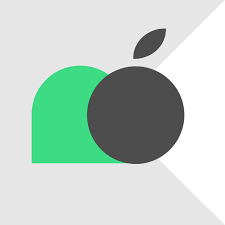
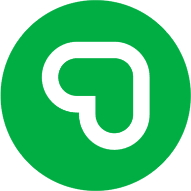
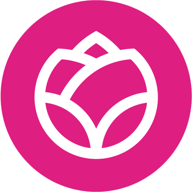

# Michael Noguera (Mike para los amigos)

## Mobile Software Engineer - Web Dev

## 📊 **Estadísticas de GitHub**

 

## 🖥️ **Conocimiento Técnico**
 

###  **Android**

**Lenguajes:** 

 

**Frameworks y Librerías:**
- XML Development
- Jetpack Compose
- Retrofit, GSON, Dagger Hilt, Koin

**Patrones de Diseño:**
- MVVM

---

###  **iOS**

**Frameworks y Librerías:**
- UIKit, SwiftUI
- Firebase, Alamofire

**Patrones de Diseño:**
- MVVM
- MVC
- VIPER

---

 **Multiplataforma**

 

**Tecnologías:**
- Flutter
- Kotlin Multiplatform

**Patrones de Diseño:**
- Provider
- MVVM (con ViewModels compartidos)

---

###  **Web**

**Tecnologías Web:**
- HTML, CSS, Bootstrap, Tailwind
- React, Next.js, Node.js

**Patrones y Herramientas:**
- Clean Architecture
- API REST, GraphQL

## Experiencia profesional

  
  <b>Viva Aerobus</b>
  - Mobile Software Engineer

  
  <b>EnvíaFlores</b>
  - iOS Engineer

  
  <b>EnvíaFlores</b>
  - Android Developer

## Formación Académica

- Ingeniería en Tecnología de Software - UANL
- Técnico en Programación - CBTis 116